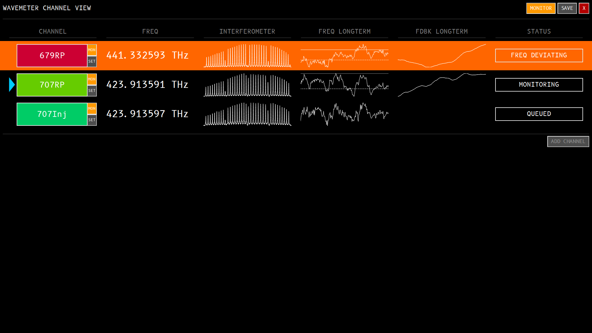

# Sr Lab Wavemeter Monitor

It is designed to work with the wave meter, fiber switch and DAC Arduino box in
Sr Lab.

Some cool features:
- A nice dashboard view to let you monitor the frequency and some crucial data
of several channels.
- PID (well, actually no D, just PI) control to set the DAC to fight against
frequency error.
- Signal Channel Display to let you have a clear view of the wave meter pattern,
long-term frequency changes, etc.
- Alert system, screaming at you if things went wrong.

## Screenshot

## TODO

### Done

- [x] dac: control instruction
- [x] dac: out-of-bound exception
- [x] channel setup: unit display
- [x] monitor: dac output
- [x] wavemeter: read/set exposure params
- [x] channel setup widget: fill in auto exposure params
- [x] monitor: set auto exposure params when switching
- [x] dashboard: channel strip background
- [x] dashboard: flash warning
- [x] dashboard: edit channel
- [x] dashboard: channel quick control
- [x] [BUG] dashboard: mysterious floating graph on top left corner
- [x] [BUG] dashboard: monitor button and add channel button still grey after dialog closed
- [x] [BUG] channel setup: crash if not dac channel set
- [x] [BUG] dashboard: color strip misplaced
- [x] monitor: determine wait time after setting exposure dynamically
- [x] dashboard: make the color strip less annoying when monitoring
- [x] channel view: emit warning
- [x] channel view: keep track of errors
- [x] channel view: display freq warning range
- [x] wavemeter: under-exposure over-exposure exception
- [x] monitor: pid out-of-lock text warning
- [x] monitor: pid railed text warning
- [x] dashboard: remove channel from monitoring
- [x] dashboard: stacked widget
- [x] dashboard: scroll
- [x] big screen: mulit-plot display
- [x] big screen: freq display
- [x] monitor: single channel monitoring
- [x] big screen: channel settings
- [x] big screen: start/stop monitoring
- [x] big screen: auto-exposure

### Planned
- [ ] dashboard: delete channel
- [ ] big screen: display the clicked graph by default
- [ ] misc: wrap the whole program
- [ ] main window: icon

### Good to have
- [ ] thumbnail: scroll zoom in/out
