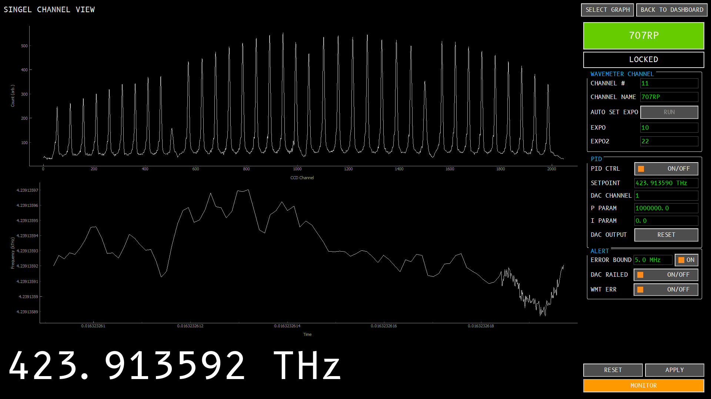

# Sr Lab Wavemeter Monitor

It is designed to work with the wave meter, fiber switch and DAC Arduino box in
Sr Lab.

Some cool features:
- A nice dashboard view to enable people to monitor the frequencies and 
some crucial data of several channels.
- PID (well, actually no D, just PI) control, setting the DAC to stabilize
the frequency (not fast enough, but can be used to deal with slow drift).
- Signal channel display to let you have a clear view of the wave meter pattern,
long-term frequency changes, etc.
- Alert system, flashing the channels if things went wrong.

## Screenshot

## Usage

1. Dependencies `pyqt5`, `numpy`, `scipy`, `pyqtgraph` should be installed in
advance.
2. Modify `config.json` to set the correct COM port of each device.
3. Run `main.py` with python.

## Docs

A introduction that briefly goes through the structure of this program can be 
found [here](wavemeter_dashboard/docs/README.md).

## TODO

### Planned
- [ ] main window: icon
- [ ] misc: wrap the whole program with `setup.py`.
- [ ] docs: document the each alert.
- [ ] docs: document config options.

### Good to have
- [ ] device interface: generalize device interface.
